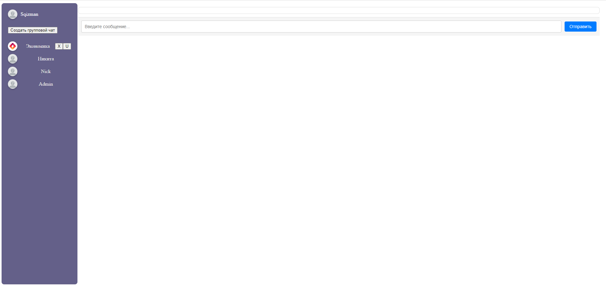
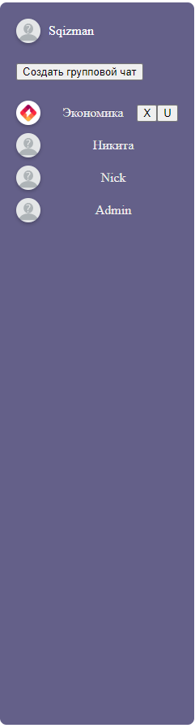

<h2>Итоговый проект 6.9</h2>
<h4>Состоящий из клиента на JavaScript и бэкенда на Django Rest Framework.</h4>
 
<h2>Инструкция</h2>
<ul>
  <li>Проект Backend! Устанавливаете зависимости pip install -r requirements.txt</li>
  <li>После установки зависимостей, запустить redis-server.</li>
  <li>Daphne интегрирован в проект, отдельно запускать не нужно!</li>
  <li>Redis нужен для отправки/получений сообщений</li>
  <li>Запуск веб-сервера:</li>
  <ul>
    <li>Вы должны находится в директории, где расположен файл 'manage.py'</li>
    <li>Веб-сервер запускается командой: python manage.py runserver</li>
    <li>Адрес веб-сервера: <a href="http://127.0.0.1:8000/">http://127.0.0.1:8000/</a></li>
  </ul>
  <li>Адреса которые прописаны в веб-сервере:</li>
    <ul>
    <li><a href="http://127.0.0.1:8000/chats">Оснавная страница</a></li>
    <li><a href="http://127.0.0.1:8000/signin">Авторизация пользователя</a></li>
    <li><a href="http://127.0.0.1:8000/signup">Регистрация пользователя</a></li>
    <li><a href="http://127.0.0.1:8000/logout">Выход пользователя</a></li>
    </ul>
</ul>
 
<h2>Навигация</h2>

Вид оснавной страницы:

Сайдбар:

<ul>
  <li>Редактирование профиля происходит при клике по username; Пример: 'Sqizman' откроется модальное окно со всей информацией, которую можно редактировать.</li>
  <li>Кнопка 'Создать групповой чат' также открывает модальное окно.</li>
  <li>Ниже идёт список всех имеющихся групповых чатов, они все кликабельны, при клике, пользователь присединяется к этому чату для общения в нём</li>
  <li>Кнопки 'X' и 'U' обазначают 'Удаления чата' и 'Редактирования чата'</li>
  <li>Далее список всех пользователей, которые зарегистрировались в мессенжере, так же кликабельны, при клике, происходит диалог между двумя пользователями.</li>
</ul>
